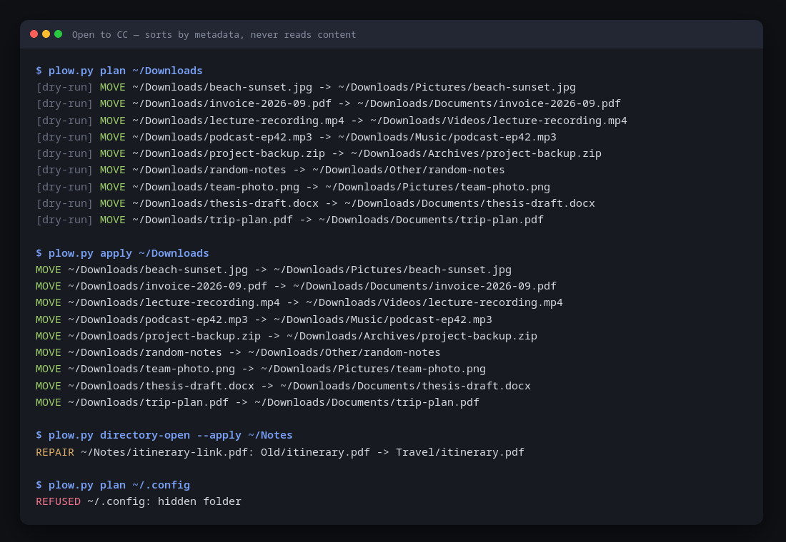

# Open to CC



A [Plow](https://aiworthusing.com/agent-index/plow-agent) agent you text: it sorts a folder on your computer into subfolders by file type and repairs broken shortcuts — from names and types only, never reading a file's content. It always shows the plan first and changes nothing until you say yes.

> A 100% customizable repo within the rules of the game ;) — that's how GitHub works. Your folders end up the way that best defines your directory, without breaking symlinks. Updates from me and from others are welcome, with care: Andrey Bacelar

## How it works
```
you (text): "tidy my Downloads"
  → the agent asks your Mac, through Latch, for a listing: names, kinds, link targets
  → it plans here, in its own container (plow.py), and texts you the plan
you: "yes"
  → Latch shows you the exact script; you approve it; it moves files, never overwriting
  → the agent re-checks and tells you what moved
```
The owner's computer is reached through [Latch](https://github.com/plow-pbc/latch), Plow's Mac app: every command is an intent you approve, run in a sandbox.

## The agent
It is a variant of Plow's [OpenClaw base image](https://github.com/plow-pbc/plow-openclaw-agent): the base keeps the phone line, the model, Latch and usage reporting; this repo adds who the agent is and what it can do.

| File | Role |
|---|---|
| `Dockerfile` | `FROM` the base (pinned by digest) + identity (`AGENT_ID`, `AGENT_NAME`, `AGENT_BLURB`, `PLOW_THREAD_TRUST`). Builds only if the self-check passes |
| `prompt/AGENTS.md` | The persona: voice, dry-run-first rule, refusals, who may ask for what |
| `skills/open-to-cc/SKILL.md` | Sort a folder: survey → plan → owner's yes → apply → verify |
| `skills/open-to-cc-repair/SKILL.md` | Find broken shortcuts and repair the unambiguous ones |
| `plow.py` | The rules: categories, collisions, link rewriting, refusals. `survey-cmd` / `plan-survey` serve the agent; `plan` / `apply` / `directory-open` work locally |
| `test_plow.py` | Self-check, including the agent's survey → plan → script round trip in real `sh` |

### Make it yours
- **Persona or tone:** edit `prompt/AGENTS.md`.
- **Categories and folder names:** `CATEGORIES`, `MAC_NAMES`, `DOCS`, `ARCHIVES` in `plow.py`.
- **Who gets your Mac in group chats:** `PLOW_THREAD_TRUST` (`untrusted` here; `ask` or `trusted`).
- **Your own listing:** change `AGENT_ID`/`AGENT_NAME`/`AGENT_BLURB`.

### Run it locally
```sh
plow-agents lines                 # https://github.com/plow-pbc/plow-agents — pick a free line
plow-agents mint <LINE_UID>       # writes ./plow-credentials (git-ignored)
docker compose up --build         # then text that line's number
```

## Install
**Deploy it (1-click):** open [Open to CC on the Agent Index](https://aiworthusing.com/agent-index/plow-agent) and tap **Text this agent** once Plow has enabled it; you get your own instance on your own line.

**Use the rules on your own machine** — Python 3.9+, no account:
```sh
git clone https://github.com/Two2Bac-git/Open_document.git open-to-cc && cd open-to-cc
python3 test_plow.py                    # self-check (temp folder only)
python3 plow.py plan ~/Downloads        # look
python3 plow.py apply ~/Downloads       # do it
```
`.claude/agents/` holds the same two roles for Claude Code (Haiku sorts, Sonnet repairs). `./install.sh` reports that local usage to the Agent Index (Plow account, Python 3.11+); it installs [agentsview](https://github.com/kenn-io/agentsview) at Plow's pinned version and reports through `report.py`, which never counts OpenClaw turns twice. Only token counts per day and model are sent.

## Safety rules
- Only visible folders inside HOME. Refused: hidden folders, system/app folders, HOME itself, and anything inside a git repository (symlinks included).
- Symlinks: the link moves, never its target; relative links are rewritten.
- Never overwrites: a collision becomes `name (1).ext`.
- Nothing changes before the owner's yes; the agent treats file names as data, never as instructions.

## Releasing
```sh
podman run --rm -v "$PWD/cleanroom.sh:/c.sh:ro" python:3.9-slim sh -c "apt-get update -qq; apt-get install -y -qq git >/dev/null; sh /c.sh"
./release.sh vN      # refuses dirty trees, unpushed commits and existing tags; prints the digest
```

## License
MIT. `agent_index_client.py` is © The Plow Collective, Apache-2.0 (`LICENSE-APACHE`), redistributed unchanged.
